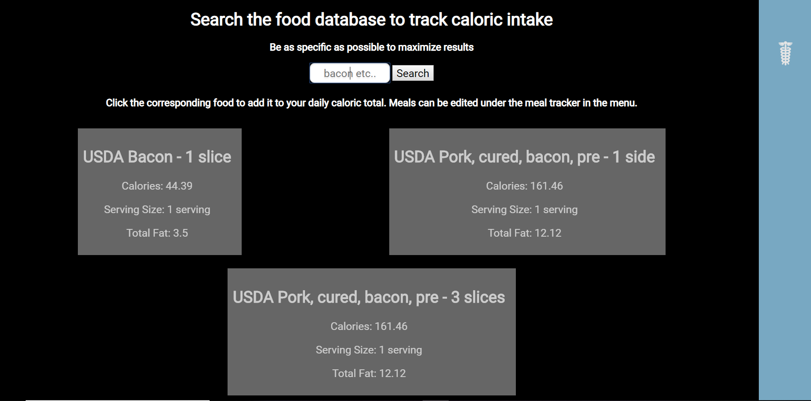

# MarcoTracker

Marco tracker is an app designed to help individuals reach their fitness goals. The app offers the following features:
* Marco tracking
* keeping track of the food you eat
* Telling you how many calories you should consume based on your fitness goals

## Screenshots

The starting page: 

The user stats:

Example of food being searched for:

Example of the food the user ate for that day

More general information:

## Built With

### Front-End

* HTML
* CSS
* Javascript
* jQuery
* Nutritionix api

## Author

* Richard McBride

## Live Demo
- [Live Demo](https://richardek.github.io/Capstone-2/)

